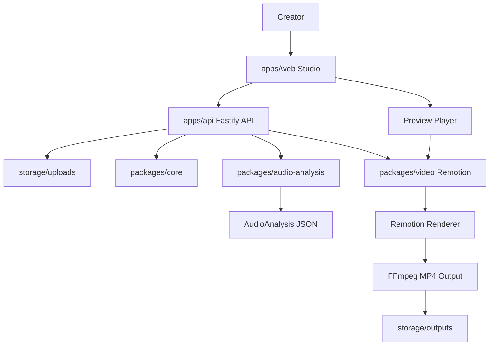

# LyricPulse Technical Design

Feature Name: lyricpulse
Updated: 2026-06-02

## Description

LyricPulse is a local-first open-source web application that generates dynamic lyric videos from audio, LRC lyrics, and cover artwork. The product uses a React Studio for upload, template editing, and preview, a Fastify API for project and render orchestration, Remotion for video compositions, and FFmpeg-based processing for audio analysis and MP4 output. The architecture starts with local file storage and local rendering while preserving extension points for SaaS storage, queued workers, and cloud rendering.

## Architecture



LyricPulse uses a pnpm monorepo with `apps/web`, `apps/api`, `packages/core`, `packages/video`, and `packages/audio-analysis`. Shared types and schemas live in `packages/core` so the Studio, API, and video templates use the same project configuration model. The API owns asset ingestion, LRC parsing coordination, audio analysis, render job creation, and output file access. Remotion templates receive normalized configuration and audio analysis data, enabling consistent preview and export behavior.

## Components And Interfaces

### apps/web

- Provides the Studio UI using React, Vite, TypeScript, Tailwind CSS, shadcn/ui, and Framer Motion.
- Contains upload flows for audio, LRC, and cover assets.
- Shows template controls, ratio controls, lyric timeline, audio analysis status, render progress, and MP4 download.
- Uses a development server reverse proxy for API requests under `/api`.
- Configures allowed hosts for `.monkeycode-ai.online` previews.

### apps/api

- Provides Fastify routes for projects, uploads, analysis status, render jobs, and output files.
- Validates request payloads through Zod schemas from `packages/core`.
- Stores uploaded files and generated outputs under local `storage` paths.
- Starts local render jobs and tracks job status in local metadata.
- Preserves provider interfaces for future storage and render backends.

### packages/core

- Defines shared TypeScript types for projects, lyric lines, audio analysis, template settings, ratios, render jobs, and provider metadata.
- Provides LRC parser and schema validation helpers.
- Keeps template configuration stable across Studio, API, and Remotion.

### packages/video

- Exposes Remotion compositions for `PulseCover`, `NeonLyric`, and `WaveformStage`.
- Supports both `9:16` and `16:9` layouts from the same template configuration.
- Consumes lyric timing and audio analysis JSON for music-reactive animation.

### packages/audio-analysis

- Produces duration, BPM, beat positions, loudness values, and simplified bass/mid/treble bands.
- Uses FFmpeg-based preprocessing and replaceable analysis adapters.
- Writes normalized JSON used by preview and rendering.

## Data Models

```ts
export type VideoRatio = '9:16' | '16:9'

export type LyricLine = {
  id: string
  startTime: number
  endTime?: number
  text: string
}

export type AudioAnalysisFrame = {
  time: number
  rms: number
  loudness: number
  bass: number
  mid: number
  treble: number
}

export type AudioAnalysis = {
  duration: number
  bpm?: number
  beats: number[]
  frames: AudioAnalysisFrame[]
}

export type TemplateId = 'PulseCover' | 'NeonLyric' | 'WaveformStage'

export type LyricVideoConfig = {
  projectId: string
  ratio: VideoRatio
  templateId: TemplateId
  title?: string
  artist?: string
  audioAssetId: string
  coverAssetId: string
  lyrics: LyricLine[]
  analysis: AudioAnalysis
  theme: {
    primaryColor: string
    accentColor: string
    backgroundIntensity: number
    fontFamily: string
  }
  effect: {
    lyricGlow: number
    pulseIntensity: number
    beatImpact: number
  }
}
```

## Correctness Properties

- Lyric lines remain sorted by `startTime` and preserve source order for equal timestamps.
- Render configuration references valid uploaded asset identifiers.
- Template rendering uses one normalized configuration model for preview and export.
- Audio analysis frames use monotonically increasing `time` values.
- Output ratio maps to deterministic Remotion dimensions for `9:16` and `16:9`.
- Render jobs keep a stable status lifecycle: created, analyzing, rendering, succeeded, or failed.

## Error Handling

- Upload validation returns asset-specific errors for unsupported formats and missing required files.
- LRC parsing reports malformed line numbers while preserving successfully parsed lines when possible.
- Audio analysis records partial results and unavailable fields when full analysis fails.
- Render failures keep source project data intact and expose a retry-ready failure reason.
- API responses use consistent JSON error payloads with `code`, `message`, and optional `details`.

## Test Strategy

- Unit test LRC parsing with valid timestamps, duplicate timestamps, malformed lines, and empty lyrics.
- Unit test Zod schemas for project configuration, template settings, and render job payloads.
- Unit test audio analysis normalization with synthetic analysis output.
- Component test Studio upload validation and template setting changes.
- Integration test API upload, project creation, analysis status, render job creation, and output metadata.
- Smoke test Remotion templates for both `9:16` and `16:9` ratios.

## References

[^1]: (Website) - Remotion video rendering framework https://www.remotion.dev/

[^2]: (Website) - Fastify web framework https://fastify.dev/

[^3]: (Website) - shadcn/ui component system https://ui.shadcn.com/

[^4]: (Website) - FFmpeg multimedia framework https://ffmpeg.org/
