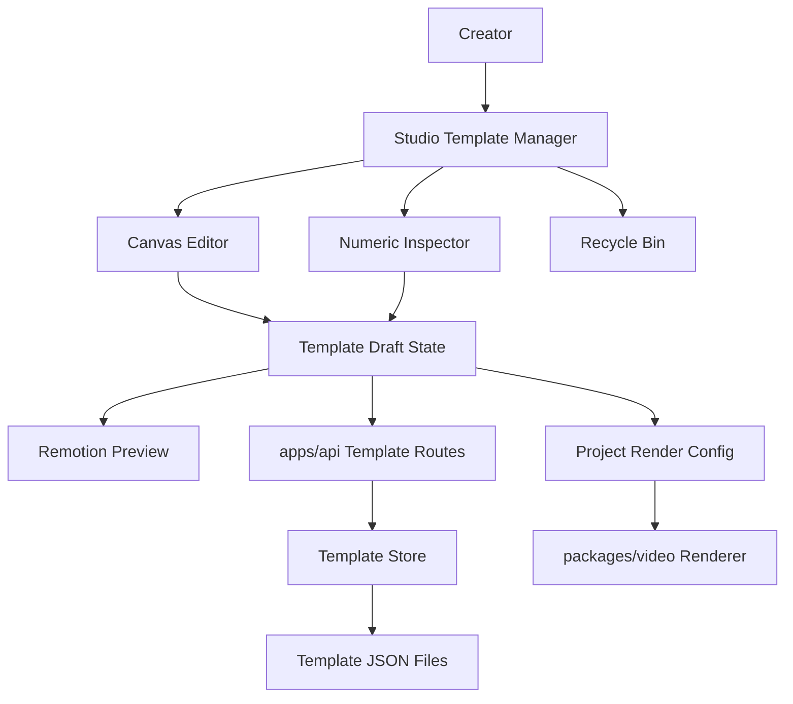

# Template Customization

Feature Name: template-customization
Updated: 2026-06-06

## Description

Template Customization introduces a template manager and editor for LyricPulse. Creators can duplicate built-in templates into custom templates, edit visual parameters, drag editable objects on the preview canvas, enter numeric position and size values, save custom templates on the server, and import or export template definitions as JSON. Admin also manages built-in template overrides, publish status, soft deletion, recycle-bin restore, and permanent deletion. The first implementation should treat custom templates and built-in overrides as configuration-driven presets over existing Remotion templates. This keeps rendering stable while enabling creator-level control over layout and styling.

## Architecture



The Studio owns interactive editing state and sends validated template definitions to the API. The API persists custom template definitions and built-in template override records, and exposes list, create, update, publish, unpublish, soft-delete, restore, permanent-delete, import, and export routes. `packages/core` defines the shared schema for template definitions, editable objects, layout values, typography values, lifecycle status, and schema versions. `packages/video` resolves a built-in template plus saved settings into concrete layout values during preview and rendering.

## Components And Interfaces

### apps/web

- Add a Template Manager panel for built-in templates and saved custom templates.
- Add a Canvas Editor layered over the existing Remotion preview.
- Add selectable editable objects for song title, artist name, lyric group, and cover in the first editable-template pass.
- Add drag handles for x/y movement and resize handles for width/height editing.
- Add a Numeric Inspector for x, y, width, height, scale, rotation, opacity, font family, font size, and visibility.
- Add import and export actions for Template JSON.
- Add publish and unpublish actions for active templates.
- Add a Recycle Bin view for soft-deleted templates.
- Add restore and permanent delete actions inside the Recycle Bin.
- Keep draft changes in UI state until the creator saves.

### apps/api

- Add routes for `GET /api/templates`, `POST /api/templates`, `GET /api/templates/:id`, `PUT /api/templates/:id`, `PUT /api/templates/:id/publish`, `PUT /api/templates/:id/unpublish`, `PUT /api/templates/:id/trash`, `PUT /api/templates/:id/restore`, `DELETE /api/templates/:id`, `POST /api/templates/import`, and `GET /api/templates/:id/export`.
- Store custom templates in a server-side template store.
- Store built-in template override records in the same template store using a deterministic identifier per built-in template.
- Validate all incoming template definitions with shared Zod schemas.
- Return clear validation errors for invalid JSON imports and out-of-range layout values.

### packages/core

- Add `TemplateDefinition`, `TemplateObjectSettings`, `TemplateLayoutBox`, `TemplateTypography`, `TemplateImportResult`, and related schemas.
- Include `schemaVersion` so future migrations can be applied during import.
- Include `baseTemplateId` to bind a custom template to an existing Remotion template.
- Include `ratioSettings` so `9:16` and `16:9` can use different coordinates and sizes.
- Include `sourceType`, `publishedAt`, `unpublishedAt`, `deletedAt`, and `archivedAt` for lifecycle management.

### packages/video

- Add a settings resolver that merges base template defaults with custom template settings.
- Update `HeroSplit` to read editable object settings for song title, artist name, lyric group, and cover.
- Keep other templates able to store Admin object settings until object-specific render support is added.
- Keep unsupported fields ignored by templates while preserving values in the template definition.
- Use the same resolved settings in preview and render jobs.

## Data Models

```ts
export type TemplateSchemaVersion = '1.0'

export type EditableObjectId =
  | 'title'
  | 'artist'
  | 'lyrics'
  | 'cover'
  | 'background'
  | 'spectrum'

export type TemplateLayoutBox = {
  x: number
  y: number
  width: number
  height: number
  scale?: number
  rotation?: number
  opacity?: number
  visible?: boolean
}

export type TemplateTypography = {
  fontFamily?: string
  fontSize?: number
  fontWeight?: number
  lineHeight?: number
  letterSpacing?: number
  color?: string
}

export type TemplateObjectSettings = {
  id: EditableObjectId
  layout?: TemplateLayoutBox
  typography?: TemplateTypography
  style?: Record<string, string | number | boolean>
}

export type TemplateRatioSettings = {
  objects: TemplateObjectSettings[]
}

export type TemplateDefinition = {
  id: string
  name: string
  description?: string
  schemaVersion: TemplateSchemaVersion
  baseTemplateId: TemplateId
  ratioSettings: Partial<Record<VideoRatio, TemplateRatioSettings>>
  theme?: Partial<LyricVideoTheme>
  effect?: Partial<LyricVideoEffect>
  createdAt: string
  updatedAt: string
  sourceType?: 'built-in-override' | 'custom'
  publishedAt?: string
  unpublishedAt?: string
  deletedAt?: string
}
```

## Correctness Properties

- Custom templates reference a valid built-in `baseTemplateId`.
- Template JSON includes a supported `schemaVersion`.
- Ratio-specific layout values apply only to the selected output ratio.
- Project render jobs store resolved settings at render creation time.
- Import validation completes before server persistence.
- Missing custom settings fall back to base template defaults.
- Templates with `deletedAt` are visible only in the Recycle Bin.
- Templates with `publishedAt` and without `unpublishedAt` or `deletedAt` are available in the Studio picker.
- Permanent deletion removes custom template files and removes built-in override files while keeping source-code built-in templates available with defaults.

## Error Handling

- Invalid template JSON returns schema validation errors with field paths.
- Unsupported schema versions return a migration compatibility message.
- Missing base templates return a recoverable compatibility message.
- Save failures keep the editor draft in memory and show a retry action.
- Out-of-range numeric values show field-specific constraints in the inspector.
- Render jobs continue using stored resolved settings if a custom template changes after the job starts.
- Restore failures keep the template in the Recycle Bin and show a retry action.
- Permanent deletion failures keep the recycle-bin item visible and show a retry action.

## Test Strategy

- Unit test core schemas for valid and invalid Template JSON.
- Unit test template settings merge behavior for default values and ratio-specific overrides.
- Unit test import migration for older supported schema versions once migrations exist.
- API test list, create, update, import, and export template routes.
- API test publish, unpublish, soft-delete, restore, and permanent-delete template routes.
- Web component test numeric inspector updates draft settings.
- Web component test canvas drag updates x and y values.
- Render smoke test custom settings for both `9:16` and `16:9` ratios.

## Implementation Notes

- Start with configuration overlays for existing templates.
- Implement drag editing for selected editable objects before adding free-form object creation.
- Implement built-in template management as override records, preserving source-code template components.
- Implement soft deletion with `deletedAt` and recycle-bin filtering.
- Implement permanent deletion as file removal for custom templates and override removal for built-in template overrides.
- Store templates as JSON files locally for the open-source edition, while keeping the API route shape compatible with hosted persistence.
- Treat template export as a pure JSON response so downloaded templates can be shared and restored.

## References

[^1]: (Filename) Existing LyricPulse requirements `.monkeycode/specs/lyricpulse/requirements.md`

[^2]: (Filename) Existing LyricPulse design `.monkeycode/specs/lyricpulse/design.md`
